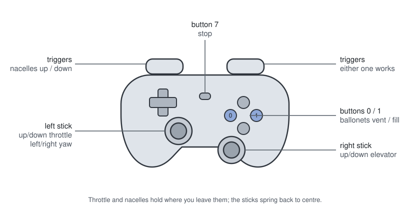

# ZLT-NT

A Zeppelin NT airship. JSBSim flight model by Anders Gidenstam (GPL-2.0-or-later, see LICENSE
and NOTICE); visuals, livery and the flying script are this package's.

## Run it

```
python fly_airship.py                 # you fly it: keyboard, gamepad, or both
python fly_airship.py --auto          # climbs, holds, descends and lands on its own
```

Spawn the airship in the editor first; the script flies what is already there. `--cruise` and
`--hold` are the `--auto` profile's height in metres (default 40) and how long to stay there
(default 60).

Needs the `pterosim` SDK, and `pygame` to fly it yourself. A small window opens -- click it,
that is where the keyboard focus lives.

## Controls



| command | key | gamepad |
| --- | --- | --- |
| Throttle, all three engines | `W` / `S` | left stick Y |
| Throttle - cut | `Space` | |
| Yaw: rudders and lateral thruster | `A` / `D` | left stick X |
| Elevator: nose up / down | `Up` / `Down` | right stick Y |
| Nacelles up / down | `Q` / `E` | triggers |
| Ballonets - vent / fill | `Z` / `X` | buttons 0 / 1 |
| Stop | `Esc` | button 7 |

Throttle and nacelles are levers and hold where you leave them; yaw and elevator spring back.
Both inputs work at once -- each channel follows whichever is moving.

To take off: throttle up, let the engines spool three or four seconds, then hold `Q` to 1.00 --
the swivel takes about four seconds. It climbs at 0.7 m/s with the nose within a degree of
level. `E` back to level and ease off to descend; cut the throttle to land, it settles on its
wheels at four degrees nose-up.

## Worth knowing

**The nacelles are not one lever.** The side pair is 8.9 m ahead of the CG, the aft one 40.5 m
behind: equal vertical thrust is a two-to-one nose-down moment, and at 90 degrees each the nose
swings between +4 and -16. The script splits them -- side 0.75 of its 120 degrees, aft 0.36 of
its 90 -- which over a 70 s climb is +0.5 degrees mean pitch instead of -9.5, and 34 m of climb
instead of 21.

**Ballonets do not lift it.** Vented at altitude for two minutes they changed the descent rate
by nothing measurable: their valves flow with a pressure difference the cells do not have. It
flies heavy and the engines carry it, as the real one does.

## What is in here

`ZLT-NT.xml` and `Systems/` are the flight model, `Controls.xml` maps the nine channels onto
it, `Visual.xml` hangs the meshes and says what moves each one: the three fins of the
inverted-Y tail, the two side pods, the tail spinner. `meshes/` and `textures/` are built from
the source hull by `Scripts/zlt_nt/` in the simulator's repository -- run those only when the
source model changes.
